# IoT Device Onboarding Workflow

This document describes the real backend-backed workflow for connecting a new IoT module to the system in this frontend.

It also calls out the separate local/mock device-management flow so it is not confused with the production onboarding path.

## Scope

- Real onboarding UI: `src/features/device-onboarding`
- Device detail and config UI after claim: `src/features/device-detail`
- API gateway endpoints: `src/lib/routes.ts` and `src/lib/api/collectorApi.ts`
- Route entry points: `src/App.tsx`
- Auth guard and user context: `src/components/ProtectedRoute.tsx`, `src/store/authStore.ts`

## High-Level Flow

```mermaid
flowchart LR
  A["User opens /dashboard/devices"] --> B["ProtectedRoute checks accessToken"]
  B --> C["/dashboard/devices redirects to /dashboard/devices/onboarding"]
  C --> D["Provision device"]
  D --> E["Generate claim code"]
  E --> F["Claim device to current user, farm plot, and zone"]
  F --> G["Refresh owned devices list"]
  G --> H["Open device detail page"]
  H --> I["View readings and config"]
  I --> J["Optionally save or push config"]
```

## 1. Entry Points

The actual onboarding page is registered under the protected dashboard routes:

- `/dashboard/devices` redirects to onboarding.
- `/dashboard/devices/onboarding` renders the onboarding screen.
- `/dashboard/devices/:deviceId` renders the device detail screen.

Relevant route wiring:

- [`src/App.tsx`](D:/KLTN/Leafy/Leafy_FE/src/App.tsx#L46)
- [`src/lib/routes.ts`](D:/KLTN/Leafy/Leafy_FE/src/lib/routes.ts#L26)

The onboarding page is protected by authentication, because dashboard routes are wrapped by `ProtectedRoute`, which requires an `accessToken`.

## 2. Prerequisites

The user must already be logged in.

Why:

- `ProtectedRoute` blocks dashboard access without an access token.
- `collectorApi` reads the current user from `authStore` and sends `X-User-Id` for user-scoped IoT requests.

Relevant files:

- [`src/components/ProtectedRoute.tsx`](D:/KLTN/Leafy/Leafy_FE/src/components/ProtectedRoute.tsx)
- [`src/store/authStore.ts`](D:/KLTN/Leafy/Leafy_FE/src/store/authStore.ts)
- [`src/lib/api/collectorApi.ts`](D:/KLTN/Leafy/Leafy_FE/src/lib/api/collectorApi.ts#L36)

## 3. Provision the New Module

The first backend step is provisioning a device record.

User input on the onboarding page:

- Device UID
- Device code
- Device name
- Device type

The UI trims whitespace and blocks submission if any field is empty.

API call:

- `POST /iot/devices/provision`

Request body:

- `deviceUid`
- `deviceCode`
- `deviceName`
- `deviceType`

Implementation:

- [`src/features/device-onboarding/pages/DeviceOnboardingPage.tsx`](D:/KLTN/Leafy/Leafy_FE/src/features/device-onboarding/pages/DeviceOnboardingPage.tsx#L131)
- [`src/lib/api/collectorApi.ts`](D:/KLTN/Leafy/Leafy_FE/src/lib/api/collectorApi.ts#L162)

What happens on success:

- The backend returns a `DeviceResponse`.
- The page stores the returned internal `device.id` in `selectedDeviceId`.
- The page also copies the returned `device.deviceUid` into the claim form.

Important detail:

- The claim-code step uses the internal `device.id`, not the external `deviceUid`.

## 4. Generate a Claim Code

After provisioning, the operator can generate a short-lived claim code for that device.

API call:

- `POST /iot/devices/{deviceId}/claim-code`

Input:

- the internal device ID returned by provisioning

Output:

- `deviceId`
- `claimCode`
- `expiresAt`

Implementation:

- [`src/features/device-onboarding/pages/DeviceOnboardingPage.tsx`](D:/KLTN/Leafy/Leafy_FE/src/features/device-onboarding/pages/DeviceOnboardingPage.tsx#L150)
- [`src/lib/api/collectorApi.ts`](D:/KLTN/Leafy/Leafy_FE/src/lib/api/collectorApi.ts#L165)

What the UI does:

- Shows the claim code in the page.
- Shows the expiration time.
- Prefills the claim form claim code field with the returned value.

Important detail:

- If the device ID is missing, the UI blocks the action and shows a validation message.

## 5. Claim the Device to the Logged-In User

This is the step that binds the provisioned module to the current user and farm scope.

User input:

- Device UID
- Claim code
- Farm plot ID
- Zone ID

API call:

- `POST /iot/devices/claim`

Request body:

- `deviceUid`
- `claimCode`
- `farmPlotId`
- `zoneId`

Headers:

- `X-User-Id` from `authStore`

Implementation:

- [`src/features/device-onboarding/pages/DeviceOnboardingPage.tsx`](D:/KLTN/Leafy/Leafy_FE/src/features/device-onboarding/pages/DeviceOnboardingPage.tsx#L170)
- [`src/lib/api/collectorApi.ts`](D:/KLTN/Leafy/Leafy_FE/src/lib/api/collectorApi.ts#L170)

What happens on success:

- The claim mutation invalidates the onboarding device list query.
- The device list refreshes automatically.

Backend-side meaning in the UI:

- provisioning status should move to `CLAIMED`
- device becomes owned by the current user
- the device is now tied to a farm plot and zone

## 6. Inspect Owned Devices

The bottom table on the onboarding page is the collector-backed list of devices owned by the current user.

API call:

- `GET /iot/devices/me`

Supported query params:

- `page`
- `size`
- `sortBy`
- `sortDir`
- `keyword`
- `status`
- `provisioningStatus`
- `zoneId`
- `farmPlotId`

Implementation:

- [`src/features/device-onboarding/pages/DeviceOnboardingPage.tsx`](D:/KLTN/Leafy/Leafy_FE/src/features/device-onboarding/pages/DeviceOnboardingPage.tsx#L121)
- [`src/lib/api/collectorApi.ts`](D:/KLTN/Leafy/Leafy_FE/src/lib/api/collectorApi.ts#L175)

What the table shows:

- device name, code, and UID
- device status
- provisioning status
- farm plot and zone
- last seen time
- actions to select the device or open the detail page

Selection behavior:

- Clicking `Select` fills the claim form with the device UID.
- If farm plot or zone already exist on the record, those are copied into the claim form too.

## 7. Open the Device Detail Page

After the module is claimed, the operator can open the detail screen for deeper inspection and configuration.

Detail page API calls:

- `GET /iot/devices/{deviceId}/detail`
- `GET /iot/devices/{deviceId}/latest-readings`
- `GET /iot/devices/{deviceId}/config`
- `GET /iot/devices/{deviceId}/charts?sensorCode=...&range=...`

Implementation:

- [`src/features/device-detail/pages/DeviceDetailPage.tsx`](D:/KLTN/Leafy/Leafy_FE/src/features/device-detail/pages/DeviceDetailPage.tsx#L330)
- [`src/lib/api/collectorApi.ts`](D:/KLTN/Leafy/Leafy_FE/src/lib/api/collectorApi.ts#L86)

What the page shows:

- device metadata
- latest sensor readings
- chart history by sensor
- current config snapshot
- config push status

## 8. Save or Push Device Config

The detail page supports a second-phase operational workflow after onboarding.

Save config:

- `PUT /iot/devices/{deviceId}/config`

Push config:

- `POST /iot/devices/{deviceId}/config/push`

The page only enables config management when:

- `device.isActive === true`
- `device.provisioningStatus === "CLAIMED"`

Implementation:

- [`src/features/device-detail/pages/DeviceDetailPage.tsx`](D:/KLTN/Leafy/Leafy_FE/src/features/device-detail/pages/DeviceDetailPage.tsx#L330)
- [`src/features/device-detail/queries/mutations.ts`](D:/KLTN/Leafy/Leafy_FE/src/features/device-detail/queries/mutations.ts)

After a push:

- the page polls the config endpoint for a short window
- it waits for `ACKED` or `FAILED`
- the UI surfaces the latest status and any push error

## 9. Local/Mock Device Management Is Separate

There is also a separate device-management area under `src/features/device-management`.

That code:

- stores farm, zone, and sensor data in Zustand
- persists it in browser storage
- does not call the backend collector API

It is a local/mock workflow, not the real onboarding path.

Important note:

- `src/App.tsx` does not register `DeviceManagementPage` as a route, so this code is not part of the live onboarding navigation.

Relevant files:

- [`src/features/device-management/pages/DeviceManagementPage.tsx`](D:/KLTN/Leafy/Leafy_FE/src/features/device-management/pages/DeviceManagementPage.tsx)
- [`src/features/device-management/components/SensorTable.tsx`](D:/KLTN/Leafy/Leafy_FE/src/features/device-management/components/SensorTable.tsx)
- [`src/store/useManagementStore.ts`](D:/KLTN/Leafy/Leafy_FE/src/store/useManagementStore.ts)

## 10. End-to-End Operator Sequence

1. Log in.
2. Open `/dashboard/devices`.
3. Provision the new module with UID, code, name, and type.
4. Generate a claim code for the newly provisioned device ID.
5. Claim the device using the UID, claim code, farm plot ID, and zone ID.
6. Confirm the device appears in the owned-devices list.
7. Open the device detail page.
8. Review latest readings and config state.
9. Save or push config if the device is active and claimed.

## 11. Practical Gotchas

- `device.id` and `deviceUid` are different values.
  - `device.id` is used for claim-code generation and the detail route.
  - `deviceUid` is used in the claim form and on the collector device record.
- The claim code is short-lived; the backend enforces validity.
- The onboarding page uses the current user ID header for user-scoped calls.
- The local mock device-management UI is not the real collector-backed onboarding path.

